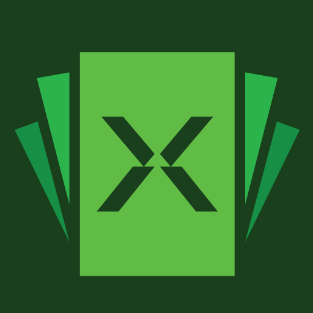

<!-- Improved compatibility of back to top link: See: https://github.com/othneildrew/Best-README-Template/pull/73 -->
<a name="readme-top"></a>
<!--
*** Thanks for checking out the Best-README-Template. If you have a suggestion
*** that would make this better, please fork the repo and create a pull request
*** or simply open an issue with the tag "enhancement".
*** Don't forget to give the project a star!
*** Thanks again! Now go create something AMAZING! :D
-->


<!-- PROJECT SHIELDS -->
<!--
*** I'm using markdown "reference style" links for readability.
*** Reference links are enclosed in brackets [ ] instead of parentheses ( ).
*** See the bottom of this document for the declaration of the reference variables
*** for contributors-url, forks-url, etc. This is an optional, concise syntax you may use.
*** https://www.markdownguide.org/basic-syntax/#reference-style-links
-->
[![Contributors][contributors-shield]][contributors-url]
[![Forks][forks-shield]][forks-url]
[![Stargazers][stars-shield]][stars-url]
[![Issues][issues-shield]][issues-url]
[![MIT License][license-shield]][license-url]
[![LinkedIn][linkedin-shield]][linkedin-url]


<!-- PROJECT LOGO -->
<br />
<div align="center">
  <a href="https://github.com/Cash-X/cashX-mobile-client">
    
  </a>

<h3 align="center">Cash X Mobile V2</h3>

  <p align="center">
   The easiest way to withdraw your money
    <br />
    <a href="https://github.com/Cash-X/cashX-mobile-client"><strong>Explore the docs »</strong></a>
    <br />
    <br />
    <a href="https://github.com/cash-x/repo_name">View Demo</a>
    ·
    <a href="https://github.com/cash-x/repo_name/issues">Report Bug</a>
    ·
    <a href="https://github.com/cash-x/repo_name/issues">Request Feature</a>
  </p>
</div>


<!-- TABLE OF CONTENTS -->
<details>
  <summary>Table of Contents</summary>
  <ol>
    <li>
      <a href="#about-the-project">About The Project</a>
      <ul>
        <li><a href="#built-with">Built With</a></li>
      </ul>
    </li>
    <li>
      <a href="#getting-started">Getting Started</a>
      <ul>
        <li><a href="#prerequisites">Prerequisites</a></li>
        <li><a href="#installation">Installation</a></li>
      </ul>
    </li>
    <li><a href="#usage">Usage</a></li>
    <li><a href="#roadmap">Roadmap</a></li>
    <li><a href="#contributing">Contributing</a></li>
    <li><a href="#license">License</a></li>
    <li><a href="#contact">Contact</a></li>
    <li><a href="#acknowledgments">Acknowledgments</a></li>
  </ol>
</details>


<!-- ABOUT THE PROJECT -->
## About The Project

[![Product Name Screen Shot][product-screenshot]](https://example.com)

Here's a blank template to get started: To avoid retyping too much info. Do a search and replace with your text editor for the following: `twitter_handle`, `linkedin_username`, `email_client`, `email`, `project_title`, `project_description`

<p align="right">(<a href="#readme-top">back to top</a>)</p>


### Built With

* [![Next][Flutter]][Flutter-Url]
* [![React][Bitrise]][Bitrise-url]
* [![Vue][Fastlane]][Fastlane-url]
* [![Angular][Firebase]][Firebase-url]


<p align="right">(<a href="#readme-top">back to top</a>)</p>


<!-- GETTING STARTED -->
## Getting Started

This is an example of how you may give instructions on setting up your project locally.
To get a local copy up and running follow these simple example steps.

### Prerequisites

This is an example of how to list things you need to use the software and how to install them.
* Run Project
  ```sh
  $ flutter run --dart-define BASE_URL=put_your_base_url_here
  ```

### Installation

1. Clone the repo
   ```sh
   $ git clone https://github.com/cash-x/cashX-mobile-client.git
   ```
2. Install Flutter packages
   ```sh
   $ flutter pub get
   ```
3.  install cocoapods (MacOS only)
   ```sh
   $ sudo arch -x86_64 gem install ffi (if you are using M1)
   $ pod install (use arch -x86_64 pod install if you are using M1)
   $ pod update (use arch -x86_64 pod update if you are using M1)
   ```
### Fastlane Setup
1. (macOS/Linux/Windows) 
```sh
Option 1 (MacOS Only) 
brew install fastlane 
Option 2 (macOS/Linux/Windows)
$ sudo gem install fastlane
```
2. Set up environment variables. 
```js
export LC_ALL=en_US.UTF-8
export LANG=en_US.UTF-8
```
You can find your shell profile at ~/.bashrc, ~/.bash_profile, ~/.profile or ~/.zshrc depending on your system

### Beta Builds
1. TestFlight
```sh
$ cd ios
$ fastlane beta
$ fastlane [lane]
$ bundle exec fastlane add_plugin [plugin]
```
📸  Learn more about how to automatically generate localized App Store  [Screenshot]

👩‍✈️  Learn more about distribution to beta testing services:
https://docs.fastlane.tools/getting-started/ios/beta-deployment/

🚀  Learn more about how to automate the App Store release process:
 https://docs.fastlane.tools/getting-started/ios/appstore-deployment/

👩‍⚕️  Learn more about how to setup code signing with fastlane
https://docs.fastlane.tools/codesigning/getting-started/

<p align="right">(<a href="#readme-top">back to top</a>)</p>


<!-- USAGE EXAMPLES -->
## Usage

Use this space to show useful examples of how a project can be used. Additional screenshots, code examples and demos work well in this space. You may also link to more resources.

_For more examples, please refer to the [Documentation](https://example.com)_

<p align="right">(<a href="#readme-top">back to top</a>)</p>


<!-- ROADMAP -->
## Roadmap

- [ ] Feature 1
- [ ] Feature 2
- [ ] Feature 3
    - [ ] Nested Feature

See the [open issues](https://github.com/cash-x/cashX-mobile-client/issues) for a full list of proposed features (and known issues).

<p align="right">(<a href="#readme-top">back to top</a>)</p>


<!-- CONTRIBUTING -->
## Contributing

Contributions are what make the open source community such an amazing place to learn, inspire, and create. Any contributions you make are **greatly appreciated**.

If you have a suggestion that would make this better, please fork the repo and create a pull request. You can also simply open an issue with the tag "enhancement".
Don't forget to give the project a star! Thanks again!

1. Fork the Project
2. Create your Feature Branch (`git checkout -b feature/AmazingFeature`)
3. Commit your Changes (`git commit -m 'Add some AmazingFeature'`)
4. Push to the Branch (`git push origin feature/AmazingFeature`)
5. Open a Pull Request

<p align="right">(<a href="#readme-top">back to top</a>)</p>


<!-- LICENSE -->
## License

Distributed under the MIT License. See `LICENSE.txt` for more information.

<p align="right">(<a href="#readme-top">back to top</a>)</p>


<!-- CONTACT -->
## Contact

Your Name - [@twitter_handle](https://twitter.com/twitter_handle) - email@email_client.com

Project Link: [https://github.com/cash-x/repo_name](https://github.com/cash-x/repo_name)

<p align="right">(<a href="#readme-top">back to top</a>)</p>


<!-- ACKNOWLEDGMENTS -->
## Acknowledgments

* []()
* []()
* []()

<p align="right">(<a href="#readme-top">back to top</a>)</p>


<!-- MARKDOWN LINKS & IMAGES -->
<!-- https://www.markdownguide.org/basic-syntax/#reference-style-links -->
[contributors-shield]: https://img.shields.io/github/contributors/cash-x/cashX-mobile-client.svg?style=for-the-badge
[contributors-url]: https://github.com/cash-x/cashX-mobile-client/graphs/contributors
[forks-shield]: https://img.shields.io/github/forks/cash-x/cashX-mobile-client.svg?style=for-the-badge
[forks-url]: https://github.com/cash-x/cashX-mobile-client/network/members
[stars-shield]: https://img.shields.io/github/stars/cash-x/cashX-mobile-client.svg?style=for-the-badge
[stars-url]: https://github.com/cash-x/cashX-mobile-client/stargazers
[issues-shield]: https://img.shields.io/github/issues/cash-x/cashX-mobile-clientsvg?style=for-the-badge
[issues-url]: https://github.com/cash-x/cashX-mobile-client/issues
[license-shield]: https://img.shields.io/github/license/cash-x/cashX-mobile-client.svg?style=for-the-badge
[license-url]: https://github.com/cash-x/cashX-mobile-client/blob/master/LICENSE.txt
[linkedin-shield]: https://img.shields.io/badge/-LinkedIn-black.svg?style=for-the-badge&logo=linkedin&colorB=555
[linkedin-url]: https://linkedin.com/in/linkedin_username
[product-screenshot]: images/screenshot.jpg
[Flutter]: https://img.shields.io/badge/flutter-6385E3?style=for-the-badge&logo=flutter&logoColor=white
[Flutter-Url]: https://flutter.dev/
[Bitrise]: https://img.shields.io/badge/bitrise-691AAD?style=for-the-badge&logo=bitrise&logoColor=white
[Bitrise-url]: https://bitrise.io/
[Fastlane]: https://img.shields.io/badge/fastlane-006CFF?style=for-the-badge&logo=fastlane&logoColor=white
[Fastlane-url]: https://fastlane.tools/
[Firebase]: https://img.shields.io/badge/Firebase-061E34?style=for-the-badge&logo=firebase&logoColor=FFCB2B
[Firebase-url]: https://firebase.google.com/
[Screenshot]: https://docs.fastlane.tools/getting-started/ios/screenshots/

